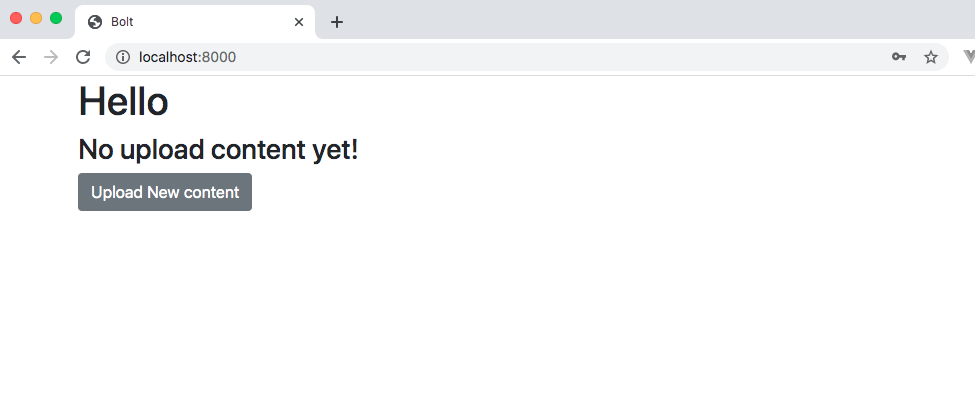
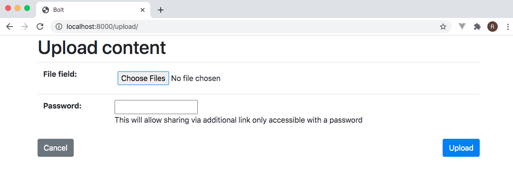
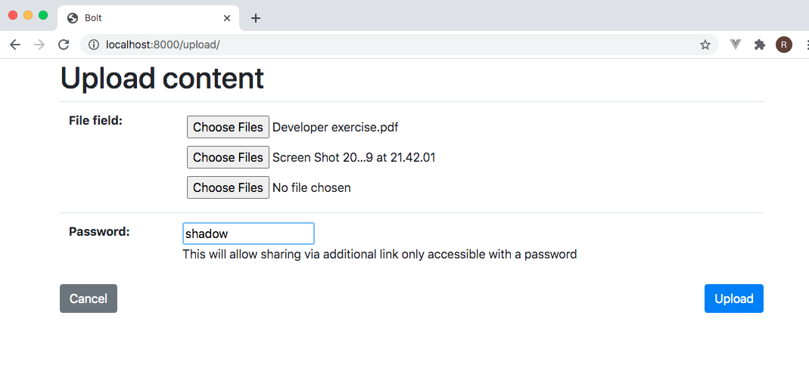
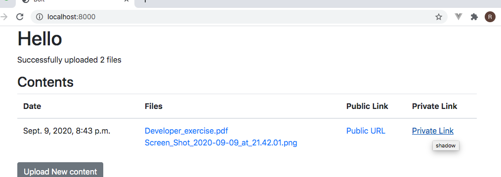
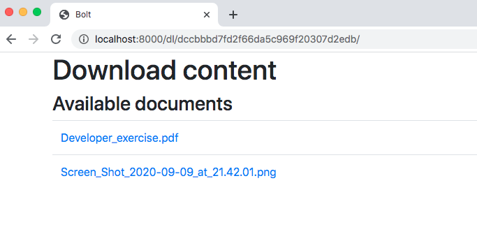

# mupload
An exercise to deliver a file transfer tool

# Setup
(assumes a *nix-like environment)
1. checkout the repository and set it as a virtual environment
```
    $ git clone https://github.com/rmendocna/mupload.git
    $ cd mupload
    $ python3 -mvenv .
    $ . bin/activate
```
2. Install dependencies and setup the DB
```
    (mupload)$ pip install -r requirements
    (mupload)$ python manage.py migrate
```
3. Create a user
```
    (mupload)$ python manage.py createsuperuser
```
4. Start the development server
```
    (mupload)$ python manage.py runserver
```
And browse to http://localhost:8000

## Screenshots

Uploads require an authenticated user.

On the user homepage there will be no records initially.



When starting a new upload, a single file field will show.

After adding a file, an additional empty file field will be generated.





An optional "password" can be entered which will provide for an additional 'private' link to the file.

The user homepage then reflects the uploaded contents.



Selecting the 'private' link forces the intermediate check stage where one must enter the previous "password".


Otherwise, one lands immediately on the contents public page.

